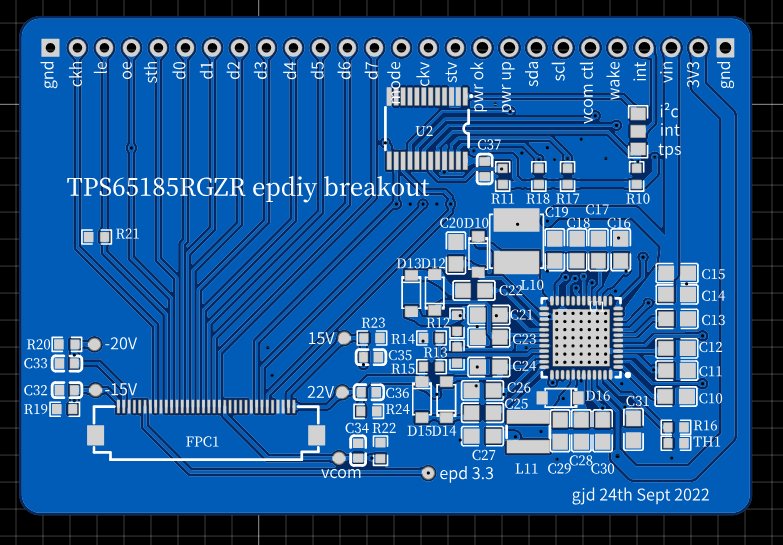

# TPS65185RGZR_breakout

This breakout board is based on epdiy v6.

It has the option of 
all pins direct to epd and TPS65185 
or as in V6 boards connection to the TPS65185 via I2c with the PCA9555/PCA9535.

It is designed for the 7x7mm TPS65185RGZR.

### 3D

### Layout

### EasyEDA files

[EasyEDA PCB](./easyeda/TPS65185RGZR_breakout/PCB_TPS65185RGZR_breakout.json)

[EasyEDA Schematic](./easyeda/TPS65185RGZR_breakout/TPS65185RGZR_breakout.json)

You can just download these files. 
 * Just follow the link and right click the Downoad button and save target as.
 * open the web based or local easyeda editor 
 * under -->file -->open--> EasyEDA open the locally saved json files.
 * you should be able to just open them without importing the libs.

If you already purchase stuff from LCSC you already have an EasyEDA account.

So you can just go to easyeda.com and login with the same credentials.  

### Gerbers

[JLCPCB compatible gerber](./gerbers/Gerber_PCB_TPS65185RGZR_breakout.zip)

### Schematic

[pdf](./schematics/Schematic_TPS65185RGZR_breakout.pdf)

