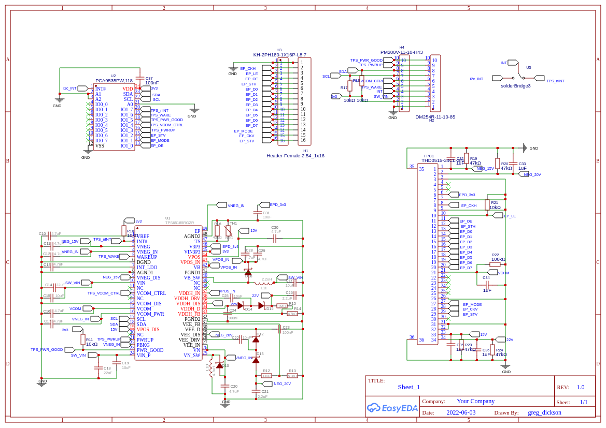

# TPS65185RGZR_breakout

This breakout board is based on epdiy v6.

It has the option of 
all pins direct to epd and TPS65185 
or as in V6 boards connection to the TPS65185 via I2c with the PCA9555.

It is designed for the 7x7mm TPS65185RGZR.

###EasyEDA files

Save the json files locally then open them EasyEDA editor as EasyEDA files.

If you already purchase stuff from LCSC you already have an EasyEDA account.

So you can just go to easyeda.com and login with the same credentials.  
 * open the web based easyeda editor 
 * under -->file -->open--> EasyEDA and find the local json files.

### Gerbers

[JLCPCB compatible gerber](./gerbers/Gerber_PCB_TPS65185RGZR_breakout.zip)

### Schematic

[pdf](./schematics/Schematic_TPS65185RGZR_breakout.pdf)

